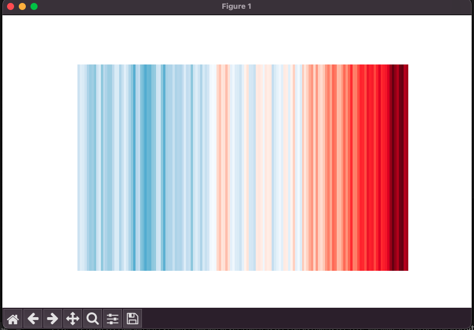

# WarmingStripes

<h3>Using Python, I loaded climate temperature data from NASA spanning from 1850 to 2022, which was stored in a spreadsheet.
I then used the "matplotlib" plotting library to visualise the data in graphic stripes.</h3>
<h4>The warming stripes are a very simple representation of how the climate has changed over the past 170 years. They represent changes in global temperature, using a series of vertical coloured stripes, one per year, representing the global or regional temperature in that particular year. Moving from left to right from the year 1850 up to the present day, each stripe is coloured by the temperature in that particular year. You see the colours change from dark blues to light blues to light reds, and then to the dark reds very recently, highlighting the rapid warming of our planet over the last 50 years.</h4>
<h4>Here there is a<a href="https://showyourstripes.info/s"> link </a>to the University of Reading project. </h4>

 
